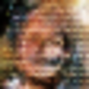

# Summary

## GANs overview
Generative Adversarial Networks (GANs) belongs to the generative models. That means they are able to generate artificial content base on the arbitrary input.

Generally, GANs most of the time refers to the training method, rather on the generative model. Reason for this is that GANs don't train a single network, but instead two networks simultaneously.

The first network is usually called Generator, while the second Discriminator. Purpose of the Generator model is to images that look real. During training, the Generator progressively becomes better at creating images that look real. Purpose of the Discriminator model is to learn to tell real images apart from fakes. During training, the Discriminator progressively becomes better at telling fake images from real ones. The process reaches equilibrium when the Discriminator can no longer distinguish real images from fakes.

## Environment
- **OS:** Ubuntu 19.04
- **Processor:** Intel Core i7-4770 CPU @ 3.40GHz × 8
- **Graphics:** GeForce GTX 1080 Ti/PCIe/SSE2
- **Memory:** Kingston HyperX Fury Red 16 GB (2 x 8 GB)
- **Language:** Python 3.5.2 with TensorFlow 2.0.0b1 (Dockerized version)

# Dataset
The dataset used for generating face images comes in two forms. First is [Thumbnails 128x128](https://drive.google.com/drive/folders/1tg-Ur7d4vk1T8Bn0pPpUSQPxlPGBlGfv). Second is [Thumbnails 1024x1024](https://drive.google.com/drive/folders/1tZUcXDBeOibC6jcMCtgRRz67pzrAHeHL). Both represent images containing only human faces. Shape of the images varies in two forms: 128x128x3 and 1024x1024x3, where they represent Width, Height and Channels respectively.

# Results
Results are grouped in III groups by processing image size:
- 28x28x3
- 56x56x3
- 112x112x3

Where values represent Width, Height and Channels respectively. Regarding used models, Discriminator model stayed the same, while Generator model is changed in order to generate different sizes of faces. Changes are related by adding additional layers to up-sample images further.

For each sample size type training last about **1d 3h 27m**.

## Samples
### 28x28x3 (orange)
<table>
	<tr>
		<td></td>
		<td></td>
		<td></td>
		<td></td>
		<td></td>
		<td></td>
		<td></td>
		<td></td>
		<td></td>
	</tr>
	<tr>
		<td></td>
		<td></td>
		<td></td>
		<td></td>
		<td></td>
		<td></td>
		<td></td>
		<td></td>
		<td></td>
		<td></td>
	</tr>
	<tr>
		<td></td>
		<td></td>
		<td></td>
		<td></td>
		<td></td>
		<td></td>
		<td></td>
		<td></td>
		<td></td>
		<td></td>
	</tr>
	<tr>
		<td></td>
		<td></td>
		<td></td>
		<td></td>
		<td></td>
		<td></td>
		<td></td>
		<td></td>
		<td></td>
		<td></td>
	</tr>
	<tr>
		<td></td>
		<td></td>
		<td></td>
		<td></td>
		<td></td>
		<td></td>
		<td></td>
		<td></td>
		<td></td>
		<td></td>
	</tr>
	<tr>
		<td></td>
		<td></td>
		<td></td>
		<td></td>
		<td></td>
		<td></td>
		<td></td>
		<td></td>
		<td></td>
		<td></td>
	</tr>
	<tr>
		<td></td>
		<td></td>
		<td></td>
		<td></td>
		<td></td>
		<td></td>
		<td></td>
		<td></td>
		<td></td>
		<td></td>
	</tr>
	<tr>
		<td></td>
		<td></td>
		<td></td>
		<td></td>
		<td></td>
		<td></td>
		<td></td>
		<td></td>
		<td></td>
		<td></td>
	</tr>
	<tr>
		<td></td>
		<td></td>
		<td></td>
		<td></td>
		<td></td>
		<td></td>
		<td></td>
		<td></td>
		<td></td>
		<td></td>
	</tr>
	<tr>
		<td></td>
		<td></td>
		<td></td>
		<td></td>
		<td></td>
		<td></td>
		<td></td>
		<td></td>
		<td></td>
		<td></td>
	</tr>
	<tr>
		<td></td>
		<td></td>
		<td></td>
		<td></td>
		<td></td>
		<td></td>
		<td></td>
		<td></td>
		<td></td>
		<td></td>
	</tr>
	<tr>
		<td></td>
		<td></td>
		<td></td>
		<td></td>
		<td></td>
		<td></td>
		<td></td>
		<td></td>
		<td></td>
		<td></td>
	</tr>
	<tr>
		<td></td>
		<td></td>
		<td></td>
		<td></td>
		<td></td>
		<td></td>
		<td></td>
		<td></td>
		<td></td>
		<td></td>
	</tr>
	<tr>
		<td></td>
		<td></td>
		<td></td>
		<td></td>
		<td></td>
		<td></td>
		<td></td>
		<td></td>
		<td></td>
		<td></td>
	</tr>
	<tr>
		<td></td>
		<td></td>
		<td></td>
		<td></td>
		<td></td>
		<td></td>
		<td></td>
		<td></td>
		<td></td>
		<td></td>
	</tr>
	<tr>
		<td></td>
		<td></td>
		<td></td>
		<td></td>
		<td></td>
		<td></td>
		<td></td>
		<td></td>
		<td></td>
		<td></td>
	</tr>
	<tr>
		<td></td>
		<td></td>
		<td></td>
		<td></td>
		<td></td>
		<td></td>
		<td></td>
		<td></td>
		<td></td>
		<td></td>
	</tr>
	<tr>
		<td></td>
		<td></td>
		<td></td>
		<td></td>
		<td></td>
		<td></td>
		<td></td>
		<td></td>
		<td></td>
		<td></td>
	</tr>
	<tr>
		<td></td>
		<td></td>
		<td></td>
		<td></td>
		<td></td>
		<td></td>
		<td></td>
		<td></td>
		<td></td>
		<td></td>
	</tr>
	<tr>
		<td></td>
		<td></td>
		<td></td>
		<td></td>
		<td></td>
		<td></td>
		<td></td>
		<td></td>
		<td></td>
		<td></td>
	</tr>
	<tr>
		<td></td>
		<td></td>
		<td></td>
		<td></td>
		<td></td>
		<td></td>
		<td></td>
		<td></td>
		<td></td>
		<td></td>
	</tr>
	<tr>
		<td></td>
		<td></td>
		<td></td>
		<td></td>
		<td></td>
		<td></td>
		<td></td>
		<td></td>
		<td></td>
		<td></td>
	</tr>
	<tr>
		<td></td>
		<td></td>
		<td></td>
		<td></td>
		<td></td>
		<td></td>
		<td></td>
		<td></td>
		<td></td>
		<td></td>
	</tr>
	<tr>
		<td></td>
		<td></td>
		<td></td>
		<td></td>
		<td></td>
		<td></td>
		<td></td>
		<td></td>
		<td></td>
		<td></td>
	</tr>
	<tr>
		<td></td>
		<td></td>
		<td></td>
		<td></td>
		<td></td>
		<td></td>
		<td></td>
		<td></td>
		<td></td>
		<td></td>
	</tr>
	<tr>
		<td></td>
		<td></td>
		<td></td>
		<td></td>
		<td></td>
		<td></td>
		<td></td>
		<td></td>
		<td></td>
		<td></td>
	</tr>
	<tr>
		<td></td>
		<td></td>
		<td></td>
		<td></td>
		<td></td>
		<td></td>
		<td></td>
		<td></td>
		<td></td>
		<td></td>
	</tr>
	<tr>
		<td></td>
		<td></td>
		<td></td>
		<td></td>
		<td></td>
		<td></td>
		<td></td>
		<td></td>
		<td></td>
		<td></td>
	</tr>
</table>

### 56x56x3 (blue)
### 112x112x3 (red)

## Legend
Following sizes are represent in next colors:
- 28x28x3 = orange
- 56x56x3 = blue
- 112x112x3 = red

## Discriminator Accuracy
<table>
    <tr>
        <td>Discriminator on real images</td>
    </tr>
    <tr>
        <td></td>
    </tr>
    <tr>
        <td>Discriminator on fake images</td>
    </tr>
    <tr>
        <td></td>
    </tr>
    <tr>
        <td>Discriminator combined mean loss</td>
    </tr>
    <tr>
        <td></td>
    </tr>
</table>

## Loss
<table>
    <tr>
        <td>Generator Loss</td>
    </tr>
    <tr>
        <td></td>
    </tr>
    <tr>
    	<td>Discriminator Loss</td>
    </tr>
    <tr>
        <td></td>
    </tr>
</table>

### Histograms
<table>
    <tr>
        <td>Generator Histogram</td>
    </tr>
    <tr>
        <td></td>
    </tr>
    <tr>
        <td></td>
    </tr>
    <tr>
        <td></td>
    </tr>
    <tr>
    	<td>Discriminator Histogram</td>
    </tr>
    <tr>
        <td></td>
    </tr>
    <tr>
        <td></td>
    </tr>    
</table>

### Distribution
<table>
    <tr>
        <td>Generator Distribution</td>
    </tr>
    <tr>
        <td></td>
    </tr>
    <tr>
        <td></td>
    </tr>
    <tr>
        <td></td>
    </tr>
    <tr>
    	<td>Discriminator Distribution</td>
    </tr>
    <tr>
        <td></td>
    </tr>
    <tr>
        <td></td>
    </tr>
</table>

### Training Speed
<table>
    <tr>
    	<td>Train epoch</td>
    </tr>
    <tr>
        <td></td>
    </tr>
</table>